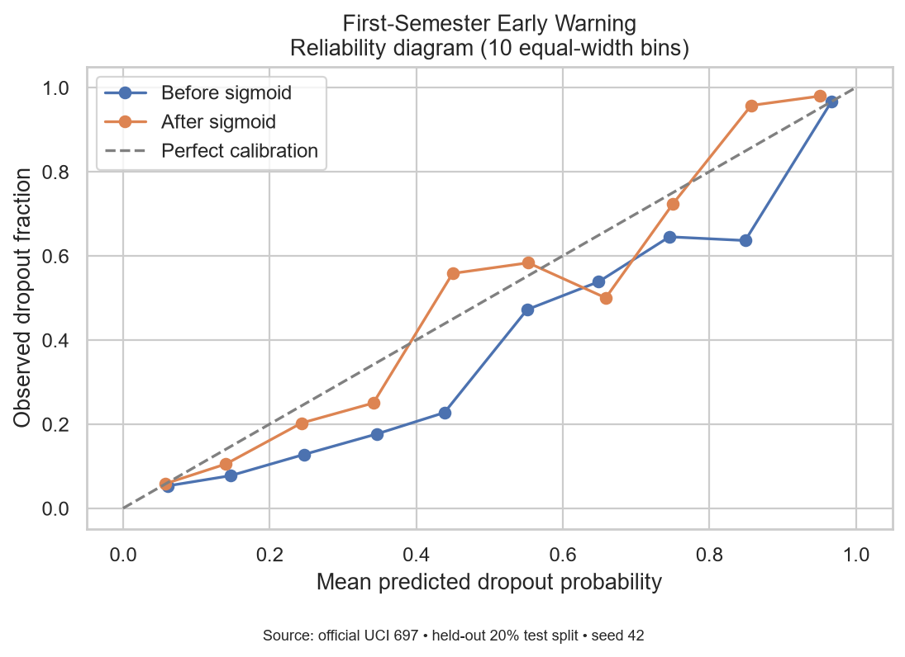
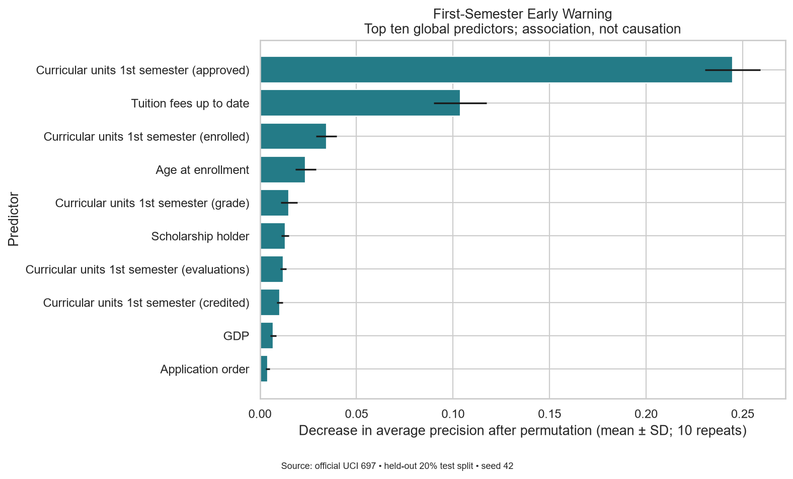
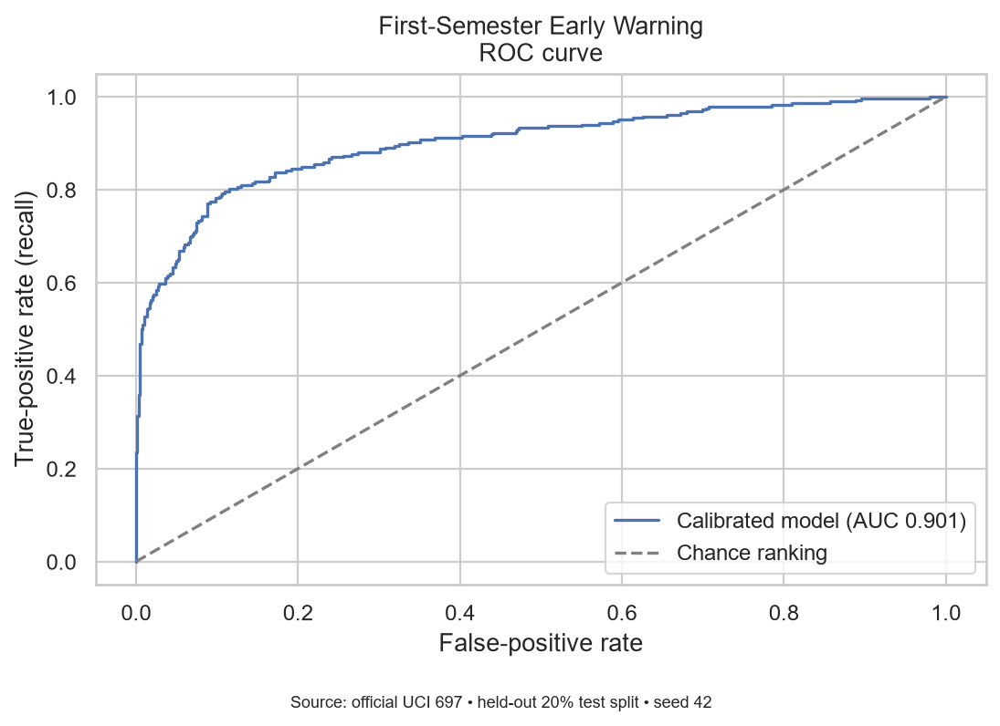
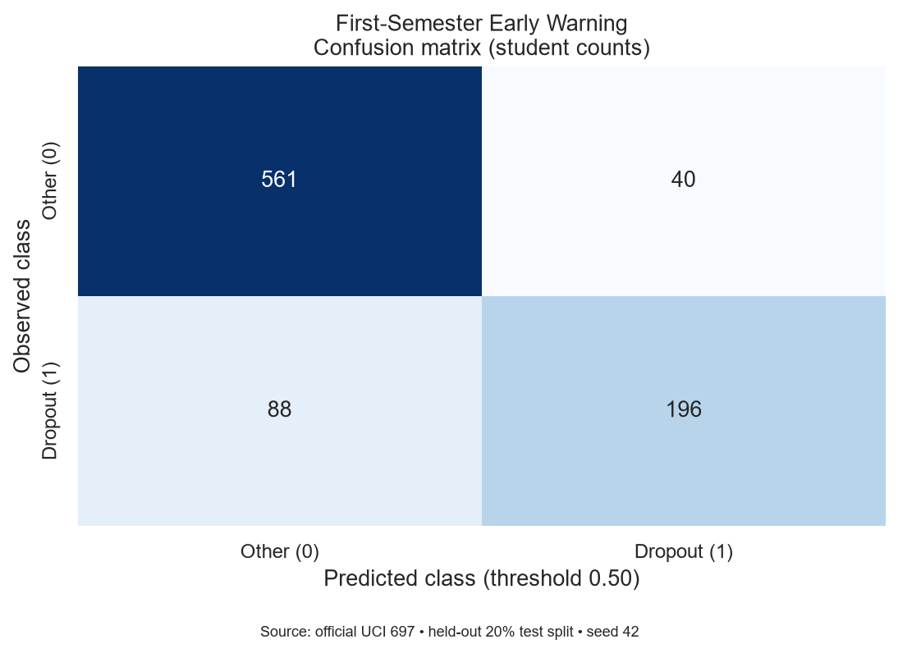

# AI-Based Student Performance Prediction Using Probability

## Abstract

This reproducible experiment estimates the probability of the recorded dropout outcome, using official UCI records and two feature-availability stages. Four classifier families were compared using training-only nested calibration and cross-validation. Gender and second-semester information were excluded from prediction. The held-out results are:

- **enrollment**: Random Forest; test AP 0.7314, recall 0.5211, Brier 0.1529, ROC-AUC 0.7977.
- **first_semester**: HistGradientBoosting; test AP 0.8638, recall 0.6901, Brier 0.1039, ROC-AUC 0.9008.

The first-semester minus enrollment test average-precision difference is +0.1324. These are retrospective results from one source dataset, not evidence that an intervention works or that probabilities transfer to another institution.

## Introduction

Universities need timely evidence for offering academic and financial support. A probability can communicate graded uncertainty better than a binary label, but its meaning depends on the outcome definition and evaluation population. This project treats dropout prediction as a research decision-support task, with human review and institutional validation required before use.

## Problem statement

The target is **Dropout = 1; Graduate or Enrolled = 0**. Thus a probability estimates the recorded dropout label under this definition. It does not directly estimate every type of academic difficulty, intelligence, potential, or inevitable future dropout. Enrolled students have unresolved final outcomes; merging them into class 0 can introduce label uncertainty and censoring.

## Aim

Build and evaluate an anonymous, calibrated early-warning research prototype for supportive student services.

## Objectives

- Compare information available at enrollment with information available after semester one.
- Compare four probabilistic classifiers using reproducible training-only selection.
- Measure ranking, classification, probability quality, and subgroup performance.
- Explain global predictive associations and communicate deployment limitations.

## Research questions

1. Which academic and enrollment factors most strongly predict student risk?
2. Which model gives the most reliable probabilities?
3. Does first-semester information improve prediction over enrollment information?
4. Are the model’s predictions equally reliable across relevant student groups?
5. Can a model trained on international data be responsibly used in Pakistan without local validation?

## Dataset description

The UCI dataset represents students in Portuguese higher education and contains enrollment and semester information. Its original outcomes are dropout, enrolled, and graduate, recorded at the normal course duration. The source lists 4,424 rows, 36 predictors, no missing values, and a CC BY 4.0 license [1].

This run read **4424 rows**, removed **0 exact duplicate records**, and retained **4424 rows**. Original outcome counts: {'Graduate': 2209, 'Dropout': 1421, 'Enrolled': 794}. Binary counts: {'0': 3003, '1': 1421}. Missing selected predictor values: 0. Training size: 3539; test size: 885. No synthetic data were used.

Actual download source: https://archive.ics.uci.edu/static/public/697/data.csv

Dataset SHA-256: `a1b1a6531bbb93a5c7fdf0093b47172776652a4ffb12342fb79655c85b74801b`. This identifies the exact bytes used. No names, contact information, or identifiers are collected in the dashboard. Published attributes may still permit indirect identification, so anonymity is not a universal privacy guarantee.

## Feature selection

Enrollment uses these 14 requested variables: Application order, Previous qualification (grade), Admission grade, Daytime/evening attendance, Displaced, Educational special needs, Debtor, Tuition fees up to date, Scholarship holder, Age at enrollment, International, Unemployment rate, Inflation rate, GDP.

The first-semester stage adds: Curricular units 1st semester (credited), Curricular units 1st semester (enrolled), Curricular units 1st semester (evaluations), Curricular units 1st semester (approved), Curricular units 1st semester (grade), Curricular units 1st semester (without evaluations).

**Timing assumption:** the source describes enrollment information, but does not provide per-field collection timestamps. Debtor, tuition status, scholarship status, and economic indicators must reflect the prediction-time snapshot. If these fields were updated after enrollment, the enrollment experiment could overestimate real early prediction. Verify timestamps or omit/retrain those fields before operational use. Semester-one features require completion of that semester. No second-semester variable is permitted by either pipeline's column allowlist.

**Gender is excluded from prediction** to avoid direct use of this protected attribute, and retained only for auditing. Exclusion cannot eliminate proxy effects or establish fairness. The source's binary codes also do not represent all gender identities. Other available variables are omitted to maintain the specified, compact feature set.

## Proposed methodology

Validate the required schema and labels, normalize column whitespace, reject malformed or infinite numeric values, remove exact duplicates before splitting, then preserve feature missingness until pipeline imputation. Median imputation is fitted only on the relevant training fold. Logistic Regression and Gaussian Naive Bayes also use standard scaling within that pipeline; tree models do not require scaling. No oversampling occurs before or after splitting.

Logistic Regression, Random Forest, and HistGradientBoosting use built-in balanced class weights. Gaussian Naive Bayes has no class_weight parameter and uses empirical training priors; its independence assumption may be unrealistic. Calibration is fitted against the unbalanced, observed training distribution, without imposing equal class priors on the calibrator.

## Probability model explanation

The output is an estimate of P(recorded Dropout = 1 given selected features). Logistic regression applies a logistic link to a weighted feature sum; Naive Bayes combines class-conditional densities; forest and boosting models learn nonlinear relationships. Sigmoid calibration fits p = 1 / (1 + exp(A f + B)), where f is a base-model score and A and B are learned from out-of-fold training scores. In a well-calibrated population, approximately 70% of cases assigned probabilities near 0.70 would have the target outcome. This is a group-frequency interpretation, not individual certainty [2].

## Experimental design

A single stratified 80/20 split (random_state=42) is reused for both stages. All four candidates undergo **five outer stratified folds**, with **five inner stratified folds** in CalibratedClassifierCV(method='sigmoid', ensemble=False). Inner out-of-fold scores fit the calibrator; the base pipeline is then refitted on that outer training partition. The outer validation fold never participates in preprocessing, calibration, or fitting. The final selected candidate is similarly calibrated using training data only.

Selection uses mean outer-fold average precision, then recall, then lower Brier score, then F1, in that exact lexicographic order. Secondary measures break exact ties; there is no post-hoc weighted scoring rule. Hyperparameters are fixed in src/modeling.py. Both selections are frozen before the test set is evaluated. The test set is never used to choose algorithms, features, calibration methods, or thresholds. Reported outer CV scores can still have model-selection optimism; the held-out evaluation addresses this for the frozen selections.

The decision threshold is 0.50. Descriptive bands are Low below 0.30, Medium from 0.30 to below 0.60, and High from 0.60. Bands do not change when the dashboard threshold changes. Any operational threshold needs prospective institutional validation and an assessment of missed cases, false alarms, support capacity, and student preferences.

## Model comparison results

PR-AUC is implemented as **average precision (AP)**, the stepwise precision-recall integral, rather than trapezoidal interpolation. Accuracy is secondary. Standard deviations across five folds are saved alongside every CV metric and are not confidence intervals.

| stage | model | cv_pr_auc | cv_recall | cv_brier_score | cv_f1 | selected |
| --- | --- | --- | --- | --- | --- | --- |
| enrollment | Random Forest | 0.6978 | 0.4863 | 0.1622 | 0.5749 | True |
| enrollment | HistGradientBoosting | 0.6962 | 0.4213 | 0.1621 | 0.5457 | False |
| enrollment | Logistic Regression | 0.6824 | 0.3764 | 0.1653 | 0.5026 | False |
| enrollment | Gaussian Naive Bayes | 0.6641 | 0.4450 | 0.1830 | 0.5236 | False |
| first_semester | HistGradientBoosting | 0.8391 | 0.6658 | 0.1139 | 0.7341 | True |
| first_semester | Random Forest | 0.8375 | 0.6939 | 0.1138 | 0.7461 | False |
| first_semester | Logistic Regression | 0.8368 | 0.6711 | 0.1123 | 0.7430 | False |
| first_semester | Gaussian Naive Bayes | 0.7521 | 0.6456 | 0.1520 | 0.6692 | False |

### Final held-out evaluation

| stage | model | accuracy | precision | recall | f1 | roc_auc | pr_auc | brier_score | log_loss |
| --- | --- | --- | --- | --- | --- | --- | --- | --- | --- |
| enrollment | Random Forest | 0.8023 | 0.7914 | 0.5211 | 0.6285 | 0.7977 | 0.7314 | 0.1529 | 0.4778 |
| first_semester | HistGradientBoosting | 0.8554 | 0.8305 | 0.6901 | 0.7538 | 0.9008 | 0.8638 | 0.1039 | 0.3444 |

The test first-semester AP change is +0.1324. This is a descriptive paired-population comparison, not a significance claim. Full metrics, CV fold results, and 400-resample percentile bootstrap intervals are separate CSVs. Bootstrap intervals condition on the fixed fitted model and one split; they do not include training variability, model selection, institutional clustering, or temporal shift.

Accuracy is the proportion correctly classified. Precision is the fraction of alerts that are recorded dropouts; recall is the fraction of dropouts detected. F1 balances precision and recall. ROC-AUC measures ranking across both classes; AP emphasizes retrieval of dropouts. Brier score is mean squared probability error; log loss penalizes confident errors. Lower Brier/log loss is better. A constant training-prevalence predictor provides context:

| stage | baseline_pr_auc | baseline_brier_score |
| --- | --- | --- |
| enrollment | 0.3209 | 0.2179 |
| first_semester | 0.3209 | 0.2179 |

## Calibration results

For enrollment, HistGradientBoosting has the lowest mean CV Brier score (0.1621). For first_semester, Logistic Regression has the lowest mean CV Brier score (0.1123). The AP selection rule may choose a different model. Brier score and log loss reflect both discrimination and calibration; neither alone proves calibrated probabilities [2]. Reliability diagrams and bin counts should be read together, particularly for sparsely populated bins. Calibration is an estimated correction and may help or worsen holdout results.

| stage | model | cv_raw_brier_score | cv_brier_score | cv_raw_log_loss | cv_log_loss |
| --- | --- | --- | --- | --- | --- |
| enrollment | Random Forest | 0.1693 | 0.1622 | 0.5125 | 0.4980 |
| enrollment | HistGradientBoosting | 0.1789 | 0.1621 | 0.5347 | 0.4977 |
| enrollment | Logistic Regression | 0.1858 | 0.1653 | 0.5521 | 0.5027 |
| enrollment | Gaussian Naive Bayes | 0.2221 | 0.1830 | 1.1033 | 0.5492 |
| first_semester | HistGradientBoosting | 0.1216 | 0.1139 | 0.3914 | 0.3722 |
| first_semester | Random Forest | 0.1168 | 0.1138 | 0.3798 | 0.3725 |
| first_semester | Logistic Regression | 0.1235 | 0.1123 | 0.4024 | 0.3693 |
| first_semester | Gaussian Naive Bayes | 0.1815 | 0.1520 | 1.1758 | 0.4758 |

| stage | raw_brier_score | brier_score | raw_log_loss | log_loss |
| --- | --- | --- | --- | --- |
| enrollment | 0.1623 | 0.1529 | 0.4975 | 0.4778 |
| first_semester | 0.1118 | 0.1039 | 0.3637 | 0.3444 |

Before/after comparisons use the same fitted base model with its calibration mapping disabled/enabled, without test-dependent refitting. The first-semester figure is below; both stages have their own figure directories.

## Fairness results

The selected model for each stage is audited on the test set at threshold 0.50. Recall has actual positives as its denominator; false-positive rate uses actual negatives. Positive prediction rate and mean predicted risk use all students in that group. Undefined rates remain missing. Brier score and observed prevalence provide additional context for probability reliability.

| stage | gender_code | gender_group | n_students | n_positive | n_negative | recall | false_positive_rate | positive_prediction_rate | average_predicted_risk | observed_dropout_rate | brier_score | threshold |
| --- | --- | --- | --- | --- | --- | --- | --- | --- | --- | --- | --- | --- |
| enrollment | 0 | Female (source code 0) | 564 | 138 | 426 | 0.5362 | 0.0540 | 0.1720 | 0.2972 | 0.2447 | 0.1291 | 0.5000 |
| enrollment | 1 | Male (source code 1) | 321 | 146 | 175 | 0.5068 | 0.0914 | 0.2804 | 0.3757 | 0.4548 | 0.1947 | 0.5000 |
| first_semester | 0 | Female (source code 0) | 564 | 138 | 426 | 0.7101 | 0.0493 | 0.2110 | 0.2766 | 0.2447 | 0.0860 | 0.5000 |
| first_semester | 1 | Male (source code 1) | 321 | 146 | 175 | 0.6712 | 0.1086 | 0.3645 | 0.4142 | 0.4548 | 0.1354 | 0.5000 |

Differences warrant investigation and **do not automatically prove discrimination**. Equal aggregate performance also does not prove fairness. Base rates, measurement differences, sample sizes, label uncertainty, and omitted confounders may contribute. These point estimates cannot establish equal probability reliability across relevant groups; subgroup calibration curves, uncertainty estimates, intersectional audits, and local stakeholder input are future work.

## Global explainability

Permutation importance shuffles each predictor on the held-out data and measures the decrease in AP over ten repetitions (seed 42). The error bars are repeat standard deviations, not confidence intervals. Negative values indicate no reliable gain on that permutation experiment. Correlated predictors may mask each other's importance. These diagnostic test-set analyses were not fed back into model selection.

### enrollment

| feature | importance_mean | importance_std |
| --- | --- | --- |
| Tuition fees up to date | 0.2520 | 0.0133 |
| Age at enrollment | 0.0748 | 0.0087 |
| Scholarship holder | 0.0457 | 0.0046 |
| Previous qualification (grade) | 0.0240 | 0.0052 |
| GDP | 0.0205 | 0.0047 |
| Admission grade | 0.0097 | 0.0040 |
| Debtor | 0.0093 | 0.0051 |
| Daytime/evening attendance | 0.0052 | 0.0017 |
| Unemployment rate | 0.0037 | 0.0020 |
| Inflation rate | 0.0018 | 0.0031 |

### first_semester

| feature | importance_mean | importance_std |
| --- | --- | --- |
| Curricular units 1st semester (approved) | 0.2448 | 0.0144 |
| Tuition fees up to date | 0.1037 | 0.0137 |
| Curricular units 1st semester (enrolled) | 0.0345 | 0.0053 |
| Age at enrollment | 0.0237 | 0.0054 |
| Curricular units 1st semester (grade) | 0.0151 | 0.0042 |
| Scholarship holder | 0.0131 | 0.0020 |
| Curricular units 1st semester (evaluations) | 0.0120 | 0.0016 |
| Curricular units 1st semester (credited) | 0.0102 | 0.0015 |
| GDP | 0.0070 | 0.0016 |
| Application order | 0.0040 | 0.0010 |

Importance describes global predictive association, not individual explanations, intervention effects, or causation. A financial feature's importance must never justify penalizing a financially vulnerable student.

## Ethical considerations

Use the system to offer support, with meaningful human review before every intervention. Students should have an understandable explanation, an opportunity to correct inputs, and a way to contest decisions. Avoid automated exclusion or denial of scholarships. Collect only necessary information, restrict access, set retention periods, and assess privacy risk before any institutional deployment. The local prototype does not store submitted student records; session state is temporary and no institutional security controls are implemented.

UNESCO's recommendation provides a rights-centered basis for human oversight, privacy, fairness, and accountability in AI [3]. Institutional governance should identify who is responsible for alerts, how harmful outcomes are reported, and when use must stop.

## Limitations

- Retrospective single-source data do not establish performance for future cohorts or another university. Random splitting is not a temporal or institution-held-out validation.
- Portuguese and Pakistani contexts differ in grading, fees, admissions, support systems, economic conditions, and outcome definitions. Directly substituting Pakistani marks or macroeconomic values is unsupported. Local validation and likely retraining/recalibration are necessary.
- Enrolled students' unresolved outcomes, unknown per-field timing, possible indirect identification, and exclusion of unavailable causal factors limit conclusions.
- Sigmoid calibration does not guarantee accuracy for an individual, subgroup, or shifted population. Probability displays have estimation uncertainty.
- Fixed hyperparameters and four algorithms form a limited search. No causal study, intervention trial, or prospective benefit analysis was conducted.
- Group diagnostics cover only the recorded binary Gender attribute; this is not a complete fairness assessment.

## Conclusion

The project produces reproducible dropout probabilities for two information stages, with separate calibration, model selection, and test evaluation. The selected models and empirical metrics above answer the ranking comparison; the Brier and reliability diagnostics address probability quality. Global importance identifies associated predictors, while fairness diagnostics show questions that need further study. A model trained internationally cannot be responsibly deployed in Pakistan without local validation and human governance.

## Future work

Collect consented, time-stamped local data; define an outcome horizon and resolve censoring; evaluate across cohorts and institutions; compare recalibration methods inside training validation; quantify subgroup uncertainty; measure drift in features, outcome prevalence and calibration; validate a supportive threshold; and prospectively evaluate benefits and harms of interventions. Retrain only under a documented review process.

## Reproducibility

Generated at 2026-09-22T09:46:33.709547+00:00. Python 3.12.7; libraries: {'numpy': '2.5.3', 'pandas': '2.3.3', 'scikit-learn': '1.7.2', 'matplotlib': '3.11.2', 'seaborn': '0.13.2', 'plotly': '6.9.0', 'streamlit': '1.50.0', 'joblib': '1.6.0'}. Run `python train.py` to reproduce outputs from the cached data. The exact installed environment is in requirements-lock.txt. Source data SHA-256 and run metadata are in experiment_metadata.json. Only load trusted joblib files.

## References

1. UCI Machine Learning Repository. *Predict Students’ Dropout and Academic Success*. https://doi.org/10.24432/C5MC89 (dataset, CC BY 4.0).
2. Scikit-learn. *Probability calibration*. https://scikit-learn.org/stable/modules/calibration.html
3. UNESCO. *Recommendation on the Ethics of Artificial Intelligence*. https://www.unesco.org/en/articles/recommendation-ethics-artificial-intelligence
